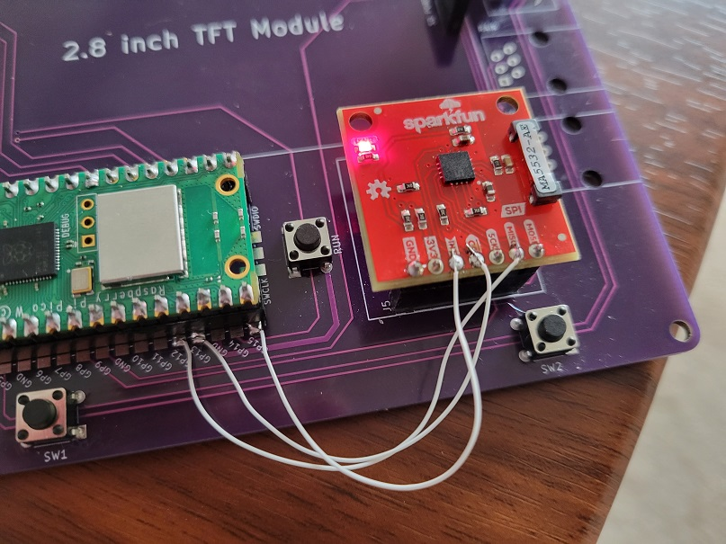

# HackerBox 0087: Picow Lightning Detector Support#

I added support for the SparkFun AS3539 lightning detector [https://www.sparkfun.com/products/15441](https://www.sparkfun.com/products/15441 "Sparkfun Lightning Detector").  Unfortunately it didn't quite go as planned.   When I would attempt to see the Chip Selector Pin in the SPI1 setup, the Pico W would hang hard.  

I eventually rewired the Hackerbox 0087 to use the default pins for SPI1.  Since I had originally set up the addition of the lighting detector with a socket (on the Hacker box PCB, and header pins on the Sparkfun board, I was able to remove the pins for the INT, CS, and MISO(RX) pins from the Sparkfun board.

(See SparkfunHeader.jpg) 

I then added wires to the HackerBox PCB board with the following connections.

<table>
<thead>
<tr>
<th>SparkFun PCB</th>
<th>HackerBox PCB</th>
</tr>
</thead>
<tbody>
<tr>
<td>INT</td>
<td>GP15</td>
</tr>
<tr>
<td>CS</td>
<td>GP13</td>
</tr>
<tr>
<td>MISO</td>
<td>GP12</td>
</tr>
</tbody>
</table>

(See Rewire.jpg) 

I could then set up SPI 1 as follows:

`const int AS3935_INT     = 15; // Interrupt pin for lightning detection ` 
`const int SPI_CS         = 13; //SPI chip select pin ` 
`const int SPI_RX         = 12; //SPI MISO ` 
`const int SPI_TX         = 11; //SPI MOSI ` 
`const int SPI_SCK        = 10; //SPI SCK ` 

And then the AS3539

`// Set up the SPI 1 hardware` 
`  SPI1.setRX(SPI_RX);` 
`  SPI1.setTX(SPI_TX);` 
`  SPI1.setSCK(SPI_SCK);` 
`  SPI1.setCS(SPI_CS);` 
`  // Start the SPI 1 channel and tell it we are using a hardware chip select` 
`SPI1.begin(true);` 

And once set up you can initialize the AS3539

`#include "SparkFun_AS3935.h"`

`SparkFun_AS3935 as3935;`

`as3935.beginSPI(SPI_CS,1000000,SPI1 );`

Finally, it seems the AS3539 picks up a lot of noise, so after setting up the interrupt functions you should call 

`as3935.readInterruptReg();`  

to clear the int line.

This should be a pretty decent example of extending the original HackerBox example to use the detector.   You'll need to supply your own OpenWeather API key and WiFi info in lines 
